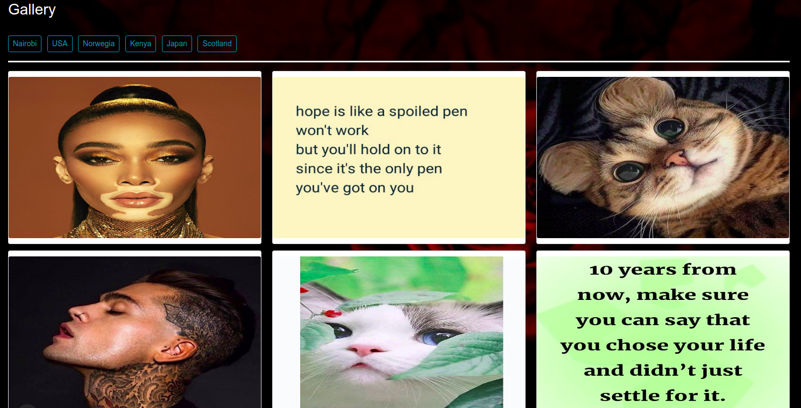

# Gallery

### By Dorothy Muhonja

### Description 
A gallery app that allow a user to view and share images.

### Set Up Instruction
* Python 3.6 and above
* Editor
* Virtual environment (optional)
*  Django
* SQLAlchemy (Postgres)

## Technologies used
* Python3
* Django
* css3
* html5
* Bootstrap


## Installation and setup
 Clone this repo
 ```
 git clone https://github.com/dorothymuhonja/Gallery.git
 ```

 ### Create and activate a virtual environment
 
    virtualenv venv --python=python3

    source venv/bin/activate

### Install django
    pip install django (and other dependencies required)

### Copy environment variable
    cp env.sample .env

### Load/refresh .environment variables
    source .env

### Running the app
```
python3 manage.py runserver
```

### Screenshots
 



## Email Address
dorothymuhonja7@gmail.com

## License and Copyright

Copyright (c) 2021 Dorothy Muhonja

[MIT License](LICENSE)